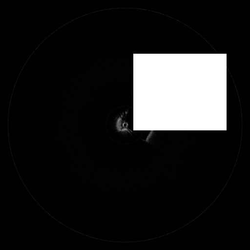
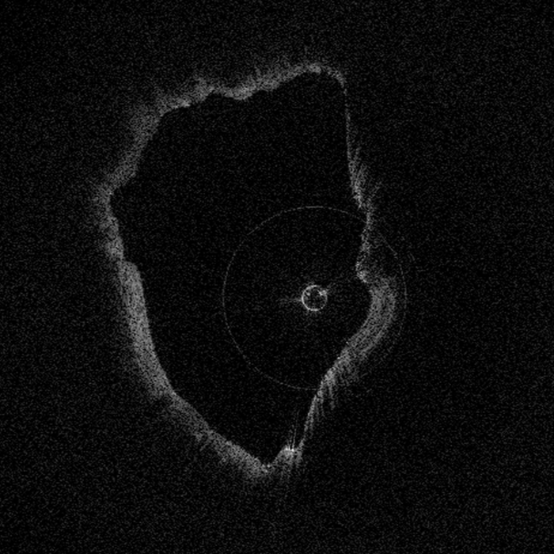
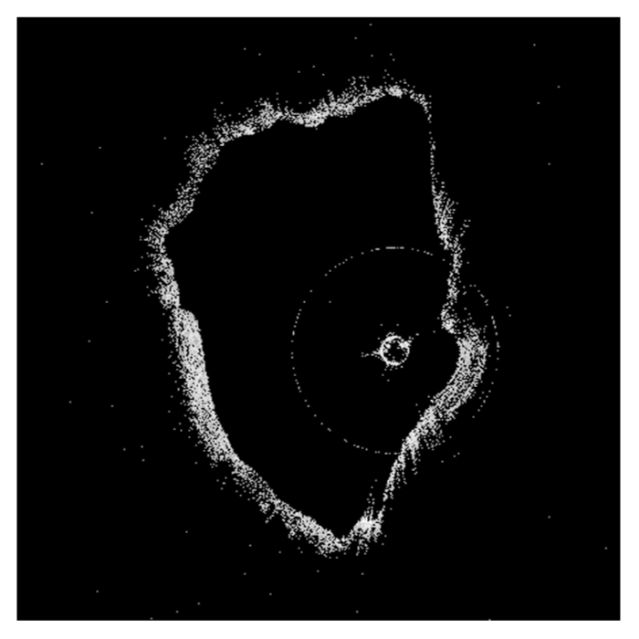

# Image Augmentation Library #
Created by Dylan Tran


#### This library is implements an image processing and augmentation pipeline for model training purposes. It has a few key features: ####

## Geometric Augmentation ## 


- From one image, various rotations and reflections are applied to generate additional images.
- Transformations include 90, 180, and 270 degree rotation, as well as reflection across x and y axes.


## Rectangular Patch Augmentation ##


- This type of transformation occludes part of an original image for use with unet segmentation/prediction models. This is useful in cases where the ground truth is known, and pairs of incomplete/complete images are needed for training.
- Rectangle generation is random, meaning that the user can specify how many images can be generated from one source image.
- The color of the rectangular patch can be modified. In this case, it is white for display purposes.


## Contrast Adjustment ## 

 
- This image processing step increases contrast between pixels, making features more visually apparent.


## Example usage: ##

- Note that, when possible, the pipe-and-filter style is implemented.
- This also means that various augmentations can be mixed and matched to vastly increase the training data.

```
imageArr = readImageDirIntoArr(r"C:\Augmentation\test_images\msk_3_7")
startIdx = 0
for augArr in rectangleCrop(imageArr, 5):
    saveOutputs(r"C:\Augmentation\sample_output", augArr, startIdx)
    startIdx += len(augArr)

```